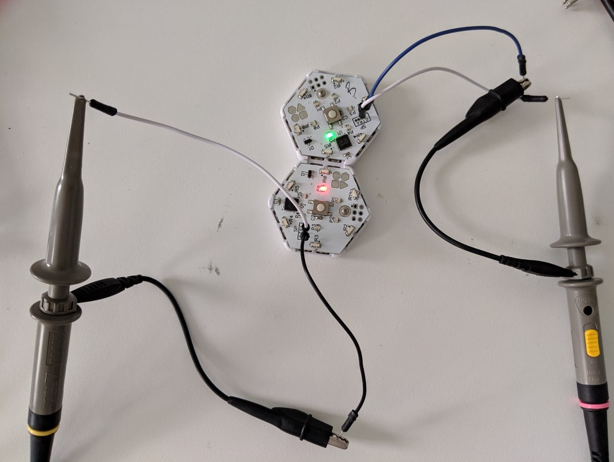

# Bare Metal Blink IR Channel Tester

This program lets you measure the response of the physical IR communications channel between two blinks. You can use it to figure out how much signal-to-noise you have to work with when designing blinks IR communication protocols.

## Bare Metal

Note that it is very unlike almost all other blinks programs you've ever seen in that it talks directly to the hardware. To make this possible, it includes the `hardware.h` file from BlinkOS and also turns off interrupt with `cli()` which effectively turns off BlinkOS's ability interrupt our code, so we have exclusive access to the hardware as long as we do not return from `setup()`.

Note that there is almost never a good reason to do this in real life!

## Concept

To stay cheap, instead of a typical LED for transmit and photo-transistor to receive, blinks use IR LEDs for both transmitting and receiving. Transmitting on an LED is easy, just turn it on. Receiving on an LED is slightly trickier.  We treat the diode inside the LED as a capacitor but reverse charging it. When photons hit the junction, they carry charge across the barrier and discharge it. When enough photons have it, the voltage across the LED will drop below a digital 1 level and we can sense this.

## Channel quality

Our bandwidth is fundamentally limited by the amount if time it takes to accumulate enough photons on the RX LED to change it from a `1` voltage to a `0` voltage. The lower this time, the faster we can theoretically send data.  The brighter the TX LED and the clearer (more photons from the TX get to the RX), then the shorter time it will take to accumulate these photons. 

There are also a bounds on the maximum time we can wait to accumulate enough photons. Physically, there will always be a leakage current across a non-ideal diode that will bleed the charge away. In practice, in a dark room this time is on the order of seconds, so it is not really a factor in practice.

But since we want blinks to work in places that are not pitch dark, we do have to worry about photons from the ambient light reaching the RX LED. This is a real factor since even indirect sunlight can be brighter than our TX LED.

As long as the time it takes for the ambient light to trigger the RX LED is *longer* than the time it takes for the TX LED to trigger the RX LED, then we have a shot at being able to reasonably send data across the channel. 

## Measuring channel quality

This tester program lets us (almost) directly measure the time between when the TX LED turns on and when the RX LED triggers.

The code has TX mode and RX mode. This is controlled by the `#define TX_MODE` at the top of the program, and it must be recompiled and re-downloaded each time this is changed. `1` means this blink will be transmitting, `0` means it will receiving. 

The code also lets you specify which face to use with the `#define IR_LED_TO_TEST`. This can be 0-5 and indicates LED IR0-IR5 respectively. Again, you must recompile and redownload when you change this.

Both modes generate their output on the `T` pin on the debug header of the circuit board. (Note that it seems like the `A` pin on this header does not work on newer blinks!)

To make measurments, you will want to connect an oscilloscope scope to the `G` and `T` pins of one TX mode blink and one RX mode blink and then point their respective test sides (as specified in `IR_LED_TO_TEST`) at each other. Here is one way that can look...

In this case, I am testing face 4 on both blinks shown.

I cut little windows in the top silicone so I could stick some jumper wires into the debug port holes.     

### TX side

The blink continuously sends pulses on the indicated side. Each pulse is 10us wide and they have ~100us between them. 

The blink turns debug pin `T` on when the IR LED is on. (Rising edge of `T` means IR LED just turned on)

### RX side

The blink charges up the indicated IR LED and waits for it to discharge.

The blink turns on debug pin `T` while it is waiting. (Falling edge of `T` means IR LED just triggered)

It also waits for about 120% of the LED on time to prevent triggering twice from the same incoming pulse. 
  
### Reading the results.

With the `T` pin outputs from the RX and TX blink each connected to a channel on your scope, scale everything up so you can easily see a 2-3 volt signal and set your time scale to about 1us per div. Next set a trigger on the rising edge of the signal from the TX blink.

#### Maximum theoretical bandwidth

With the blinks set up so that they can see each others' faces, you should see something like this...

Here the YELLOW trace is TX and BLUE trace is RX.

You are interested in the time between when the TX goes high (TX LED turns on) and the RX goes low (the RX LED triggers). The shorter this time is, the higher the theoretical bandwidth of the communications path. In this case, the time is about 6us. 

You can move the blinks around to see how alignment impacts this time. Cleaner path should lead to shorter times (better). The longest time is what sets the worst case.

You can also try different battery voltage levels. Lower voltage on the TX blink should mean dimmer LED and so longer times to trigger the RX blinks (worse). The impact of battery voltage on the RX side is less clear since the `1` to `0` transition voltage is dependent on the battery voltage. LMK if you discover any correlation between RX voltage and trigger time!   

You can also set the scope display to "infinite" if you want to accumulate a bunch of reading to find the boundaries.

#### Ambient Noise

Now separate the blinks so that the RX is looking into the wilderness. We do not care about the TX blink for this test, you you can turn off that channel on the scope and this time trigger on the rising edge of the RX `T` signal. 

It should look something like this...

 

Here the BLUE trace is the RX.

You are interested in the time that the RX signal is high between triggers. The longer this time is, the more time it will take for an RX LED to trigger because of noise rather than real signal. In this case, the time is about 1.5ms.

You can move the blink around and point the face you are testing a a bright wall or a cover it with your hand and see how that impacts the time. Brighter should lead to shorter times (worse). The shortest time is what sets the worst case. The impact of battery voltage on the ambient noise triggers is less clear since the `1` to `0` transition voltage is dependent on the battery voltage. LMK if you discover any correlation between RX voltage and ambient trigger time!   
 
You can also set the scope display to "infinite" if you want to accumulate a bunch of reading to find the boundaries.

## Conclusion

That's all, you just measured the only two parameters that characterize the communication channel between any two blink faces! The longest TX trigger time and the shortest ambient trigger time across a population of blinks and across a range of lighting conditions and battery voltage levels will limit the maximum theoretical communications rate between blinks.

Practically speaking, the real world maximum bandwidth will also be limited by the horsepower of the CPU and the protocol constraints.      
